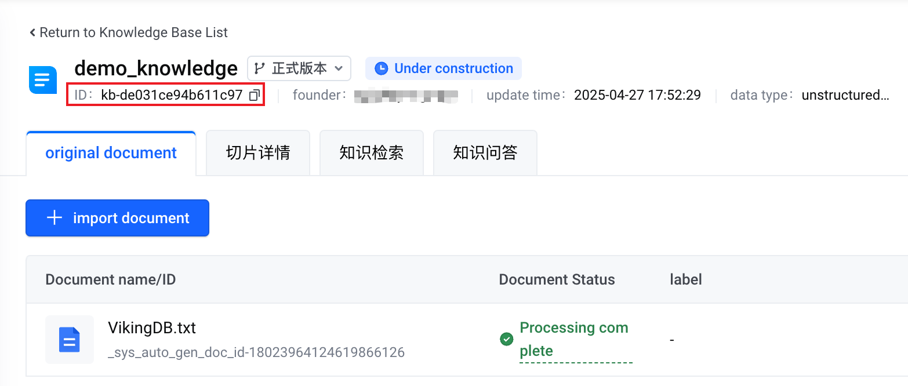
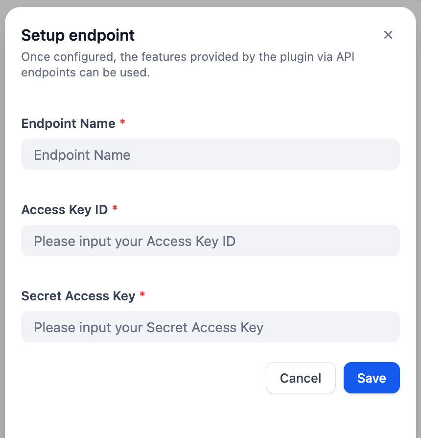
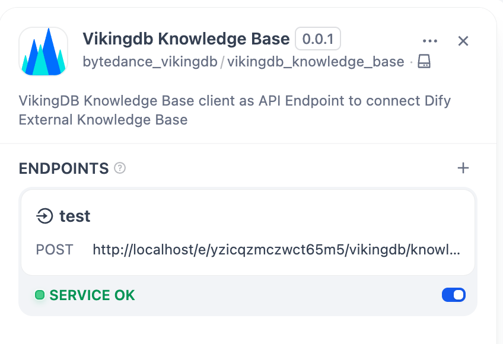
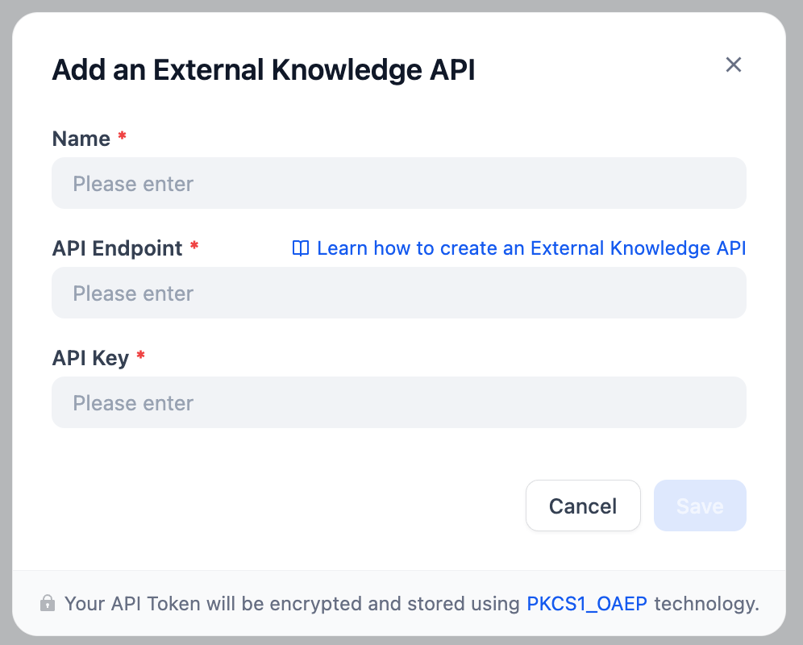
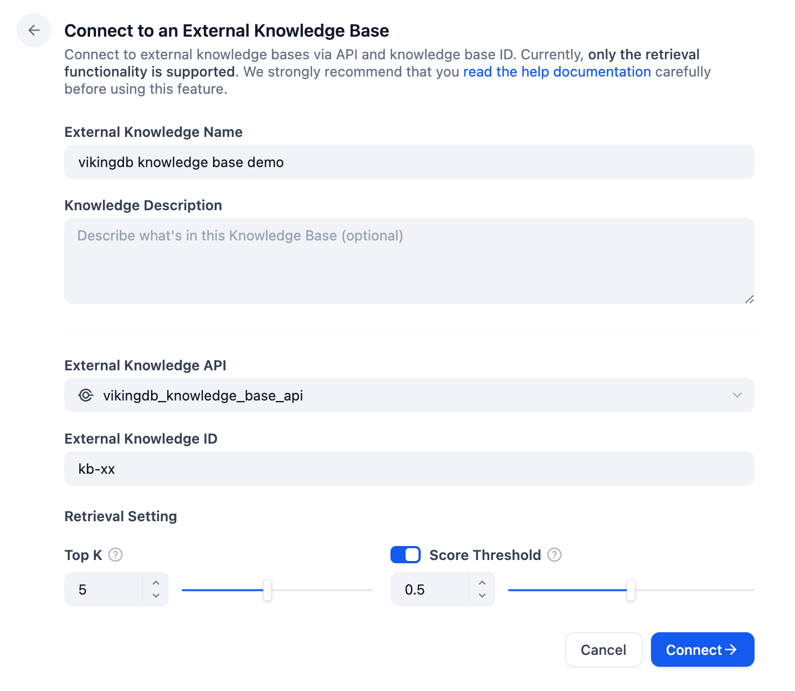
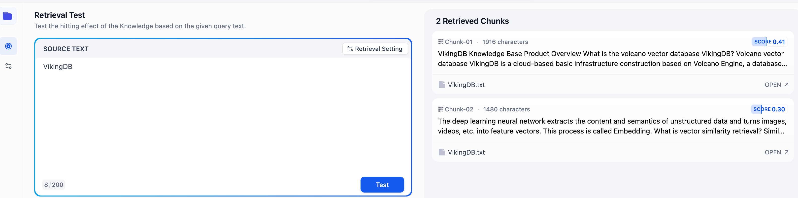

## vikingdb_knowledge_base

**Author:** bytedance_vikingdb
**Version:** 0.0.1
**Type:** extension

### Description

When building an AI Agent with context retrieval capabilities without primarily relying on Dify's native Knowledge Base, you may utilize Dify's External Knowledge Base to integrate with your preferred RAG solution. This plugin facilitates deploying your VikingDB Knowledge Base client as an endpoint, enabling seamless connectivity with Dify's External Knowledge Base.

Prerequisites: Ensure your VikingDB Knowledge Base is already set up. For operational guidance, refer to the VikingDB Knowledge Base documentation at https://www.volcengine.com/docs/84313/1254439.

Required Information from VikingDB:

Volcengine Access Key and Volcengine Secret Access: These credentials can be obtained from the security credentials section in the upper-right corner of your Volcengine console. For detailed instructions, see https://www.volcengine.com/docs/6291/65568.

Knowledge ID: This is generated upon completing the configuration of your VikingDB Knowledge Base.

Connection Steps:

Configure VikingDB Endpoint:

Access the VikingDB Knowledge Base Endpoint setup interface and input your Volcengine Access Key and Secret Access to initialize the endpoint.

Retrieve Endpoint URL:

Copy the URL of the newly created endpoint for subsequent use.

Configure Dify External Knowledge API:

Navigate to Dify Knowledge Base and select External Knowledge API in the upper-right corner.

Paste the copied URL into the API Endpoint field. Before saving, ensure to remove the "/retrieval" suffix from the URL.

Assign a name to the endpoint. Since no authorization mechanism is configured, the API Key field can be filled with arbitrary values; however, strictly safeguard the endpoint URL to prevent unauthorized access.

Establish Connection:

After setup, click Connect to External Knowledge Base, select the newly created external knowledge API, and input the Knowledge ID. Optional parameters such as top k and threshold can be configured prior to finalizing the connection.

Testing:

Initiate a retrieval test to verify functionality. A successful response should return relevant knowledge chunks from your VikingDB Knowledge Base.
