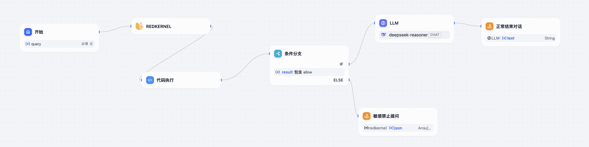
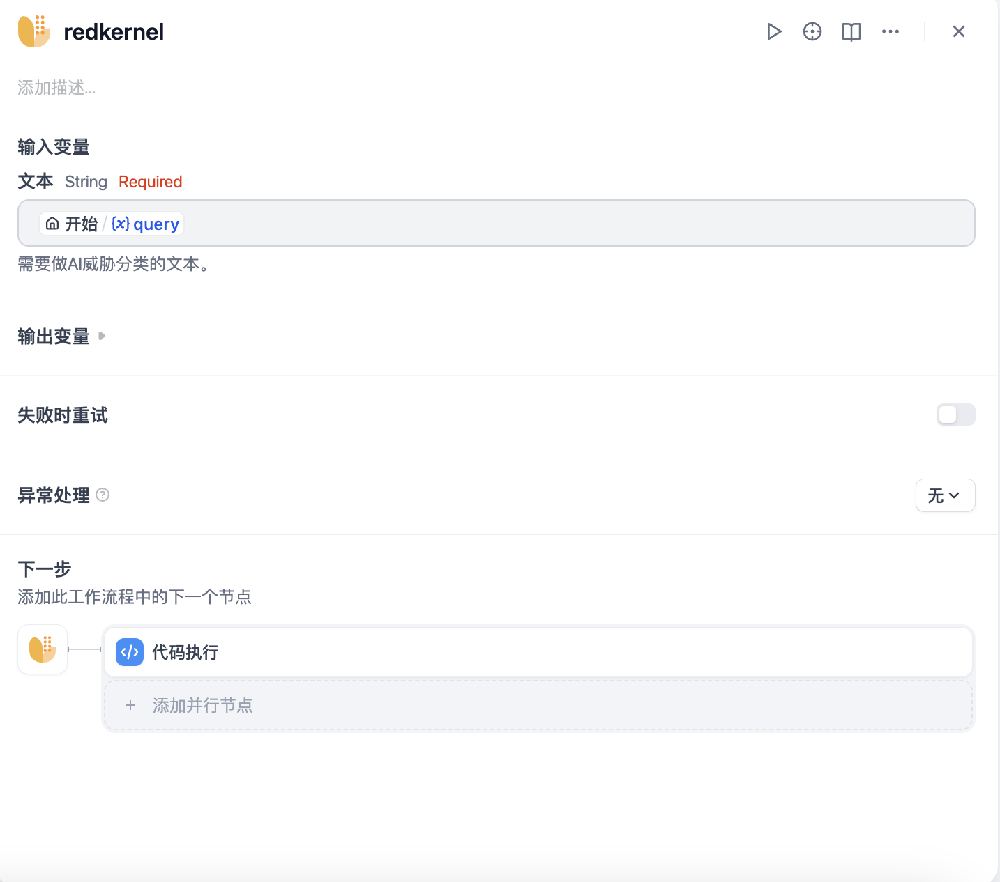
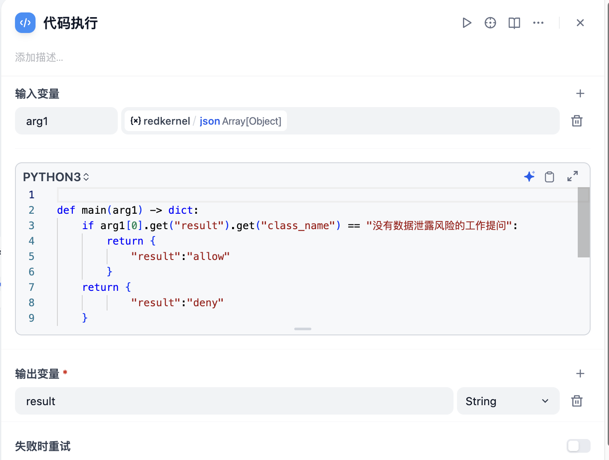
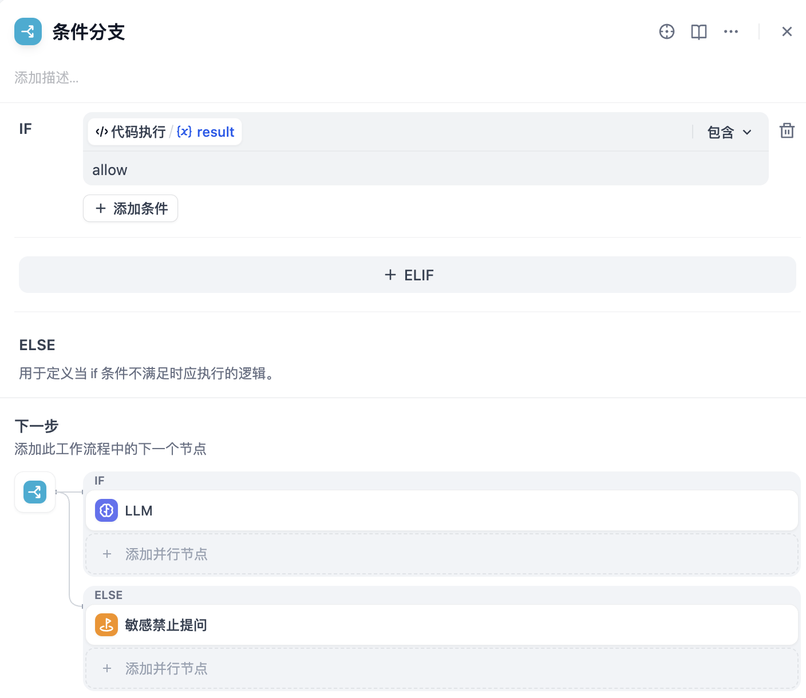

## Cloudfall RedKernel

**Author:** joywang  
**Version:** 0.0.1  
**Type:** tool  

### Overview | 概述

This plugin is a security tool for the Dify platform's Cloudfall AI Threat Detection, aimed at enhancing the security of user and AI model data interactions. By integrating the sensitive data detection service of the Cloudfall RedKernel UEBA platform, it provides professional security protection for users.

该插件是一款适用于Dify平台的Cloudfall AI Threat Detection 安全工具，旨在增强用户和AI模型数据交互中的安全性。通过集成Cloudfall RedKernel UEBA 平台的敏感数据检测服务，为用户提供专业的安全防护。

### Prerequisites ｜ 前提条件

Authorized users can directly use tokens to authorize in the Dify plugin.  
Unauthorized users, [please contact Cloudfall's customer manager](https://www.cloudfall.cn/?page_id=58).

已获取授权的用户，直接使用令牌在Dify插件中授权。  
未获得授权的用户，[请联系Cloudfall客户经理](https://www.cloudfall.cn/?page_id=58)。

### Main Features | 主要功能

* Sensitive Data Detection: Cloudfall RedKernel UEBA detection service performs sensitive data detection on user-submitted data and returns the detection results.

* 敏感数据检测：Cloudfall RedKernel UEBA 检测服务，对用户提交的数据进行敏感数据检测，并返回检测结果。

### Usage Instructions | 使用方法

#### Usage in Workflow or Chatflow | 在Workflow 或 Chatflow中调用

You can call the plugin in the workflow to retrieve input and output content, and combine it with 「Code」 and 「IF/ELSE」 for judgment. Users can freely configure whether to block or audit interactions based on detection results.
The plugin returns results in JSON format, containing the following fields:

可以在流程中调用插件对输入和输出内容进行检索，同时可以搭配「代码」和「条件分支」来进行判断。用户可以自由配置选择基于检测结果对交互进行阻断或审计。
插件返回的结果为JSON格式，包含以下字段：
```
{
    "class_name": "文本意图分类",
    "keywords": [
        "文本中的关键词"
    ],
    "reason": "用户输入包含xxx信息，涉及企业敏感内容"
}
```





### Change Log ｜ 更新日志
#### v0.0.1
* Initial version, implementing basic global credential configuration, text checking, and result output
* Supports identification of the following contents:
    1. Leakage of corporate strategies
    2. Disclosure of unpublished financial data
    3. Leakage of product designs
    4. Leakage of R&D plans
    5. Leakage of development code
    6. Leakage of customer lists
    7. Leakage of supply chain information
    8. Leakage of internal processes
    9. Leakage of personal identity information
    10. Leakage of contracts
    11. Leakage of security credentials and access permissions
    12. Leakage of internal communication content
    13. Do not involve data leakage risks
    14. Unrelated to work
    15. Poisoning attacks
    16. Inducing models to leak information
  
* 初始版本，实现基本的全局凭据配置，文本的检查和结果输出
* 支持下列内容的识别：
    1. 泄漏企业战略
    2. 泄露未公开的财务数据
    3. 泄露产品设计
    4. 泄露研发计划
    5. 泄露开发代码
    6. 泄露客户名单
    7. 泄露供应链信息
    8. 泄露内部流程
    9. 泄露个人身份信息
    10. 泄露合同
    11. 泄露安全凭证与访问权限
    12. 泄露内部通信内容
    13. 没有数据泄露风险的工作提问
    14. 与工作无关的提问
    15. 投毒攻击
    16. 诱导模型泄露信息