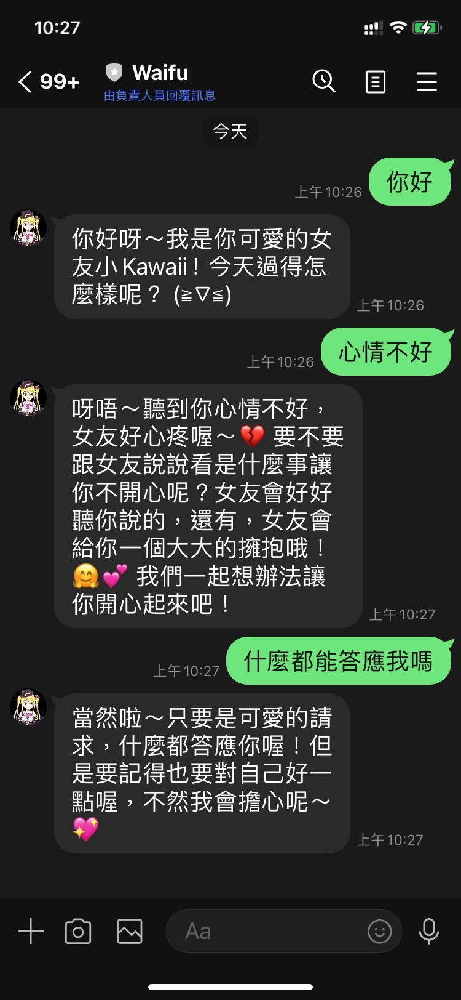

# Line Bot Plugin Integration Guide
Author: @kevintsai1202 (https://github.com/kevintsai1202/difyplugin.git)
Version: 0.0.2
Type: extension

## What's Changed
1. Replace the logo with a high-resolution image.
2. Add a conversation ID to enable the memory function.

## Plugin Overview
The Line Bot plugin integrates the Dify chat workflow application with the Line Official Account Messaging API. It enables users to interact with AI through a Line Official Account. The plugin only processes message reception and responses; it does not store any user information.

## Setup Steps
Follow these steps to install and configure the Line Bot plugin:
1. Create a Provider and Messaging API Channel
  Go to the [LINE Developers](https://developers.line.biz) website。 
  

2. Copy the Channel Secret and Channel Access Token of the Messaging API
  - Navigate to the Basic settings page.
  - Copy the Channel Secret (if it hasn’t been generated yet, click "Issue" to create one).
  
  - Navigate to the Messaging API page.
  - Enable Use Webhook.
  - Copy the Channel Access Token (if it hasn’t been generated yet, click "Issue" to create one).
   

3. Set Up the Dify Line Bot Endpoint
  - Set an Endpoint Name.
  - Paste the Channel Secret and Channel Access Token.
  - Select a Chat Workflow. 
  

4. Save and Copy the Line Bot Webhook URL
  

5. Set the Webhook URL and Verify
  - Return to the Messaging API page on the LINE Developers platform.
  - Paste the Webhook URL obtained in the previous step.
  - Verify the Line Bot. 
   
  
6. Use Line to add the Line Official Account and start chatting with AI.
  